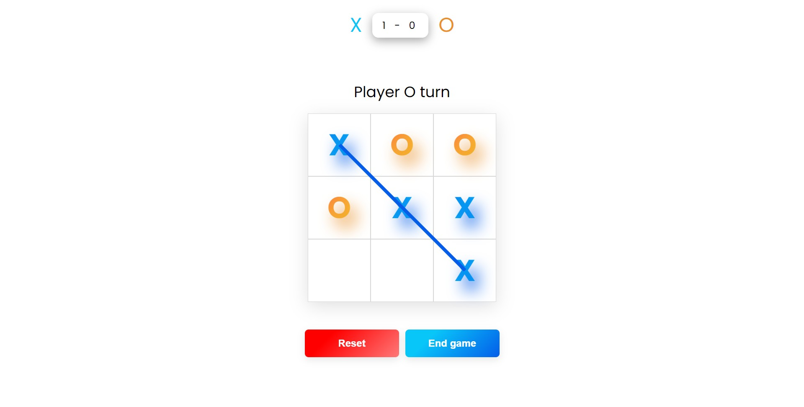

# tic-tac-toe


# Tic-Tac-Toe

A simple, interactive implementation of the classic Tic-Tac-Toe game using HTML, CSS, and JavaScript.

## 🚀 Live Demo

Play the game here: [Tic-Tac-Toe](https://tic-tac-toe-ten-omega-37.vercel.app/)

## 📂 Repository

Source code: [GitHub Repository](https://github.com/Manish50518/Tic-Tac-Toe)

## ✨ Features

- **Interactive Gameplay**: Two-player mode with alternating turns.
- **Simple UI**: Minimalistic design for a seamless experience.
- **Responsive Design**: Adapts to various screen sizes.
- **Clear Feedback**: Highlights winners or declares a draw.

## 🛠️ Technologies Used

- **HTML**: For structure.
- **CSS**: For styling and layout.
- **JavaScript**: For game logic and interactivity.

## 📜 How to Run Locally

1. **Clone the Repository**:
   ```bash
   git clone https://github.com/Manish50518/Tic-Tac-Toe.git
